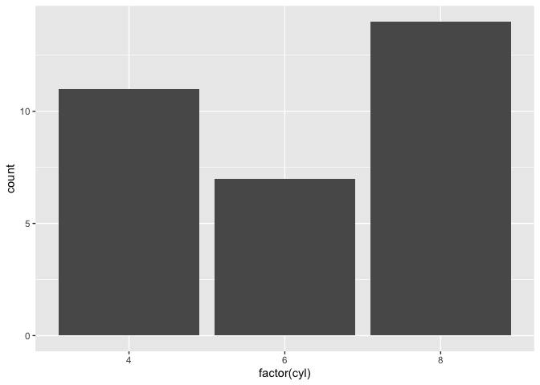

# This is my first Markdown file
## This is my first Markdown file
### This is my first Markdown file

```r
4*2
```

```
## [1] 8
```

## This is my [email](mailto:rjdean@ucdavis.edu)

## This is [Google](http://www.google.com)


```r
#install.packages("tidyverse")
library("tidyverse")
```

```r
ggplot(mtcars, aes(x = factor(cyl))) +
    geom_bar()
```

<!-- -->
